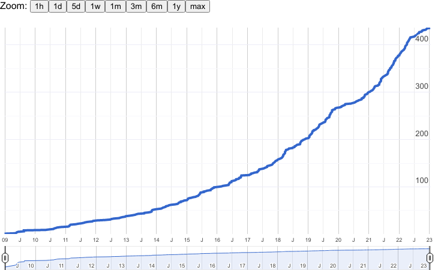
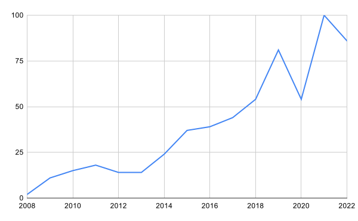

# haskell-jobs-statistics

This repo collects analyses of the Haskell jobs market.

Summary: **The Haskell job market has been growing steadily since 2008.**

## Reddit `/r/haskell`

In 2023-01-12 I gave a beginner talk at the Zurich [HaskellerZ](https://zfoh.ch/) meetup, teaching how to use the Reddit API ([code](https://github.com/nh2/haskell-reddit-jobs-counter)).

From this, I compiled and manually verified a Google Sheet ([link](https://docs.google.com/spreadsheets/d/1X8MDuYRcrTiYjdzq24aOhloo9tTwL0gqGWWYggvcW3s/edit?usp=sharing)) to create the following graphs:

### Cumulative Haskell Reddit job postings over time (2008-2022)

### Bucketed per year

